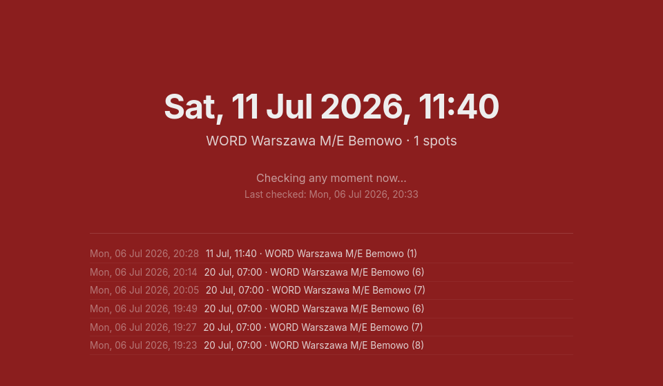

# info-kierowca-notifier

[](https://github.com/FilipNowakowicz/info-kierowca-notifier/actions/workflows/ci.yml)
[](LICENSE)
[](https://www.python.org/)

A notification-only slot checker for [info-kierowca.pl](https://info-kierowca.pl), the Polish
driving exam booking portal. It polls for open exam slots and alerts you via a local dashboard and
a phone push when one appears, plus a desktop notification on errors (session expired, unexpected
API response, etc.) — it never books, reserves, or clicks anything on your behalf. You always do
the final booking yourself, in your own browser.



## Features

- Polls info-kierowca.pl's own API for real exam slot availability
- Phone push via [ntfy.sh](https://ntfy.sh) when a slot appears within your chosen window
- Local read-only dashboard at `http://127.0.0.1:8787`
- Strictly read-only — never books, reserves, or submits anything
- Zero dependencies (Python standard library only) — works on Linux, macOS, and Windows

## How it works

It reads exactly two endpoints:

- `GET /bknd/auth/api/v1/jwt/refresh` — keeps your session alive
- `POST /bknd/exam/api/v1/Schedules/user/MultipleCentersExams` — reads slot availability

Both are the same endpoints info-kierowca.pl's own web app calls; this project just automates
checking them on a timer using your existing logged-in session cookies, instead of you refreshing
the page by hand.

## Responsible use

This does the minimum necessary to notify you, on purpose:

- Polls at a modest default interval (once a minute) — please don't tighten that or bolt on
  booking automation; that changes this from a notifier into something else entirely.
- Never sends your session cookies or PKK number anywhere except info-kierowca.pl itself. Only
  plain, human-readable notification text goes to ntfy.sh.
- Relies on an undocumented, reverse-engineered API that info-kierowca.pl could change or block
  at any time — use at your own risk and in line with the site's terms of service.

Requires Python 3.9+ and nothing else (standard library only).

## Setup

1. Copy the example config files into `~/.config/info-kierowca-notifier/` (this works the same
   way on Windows, macOS and Linux — Python resolves `~` to your user profile folder either way).

   **Linux / macOS:**
   ```
   mkdir -p ~/.config/info-kierowca-notifier
   cp config.example.json ~/.config/info-kierowca-notifier/config.json
   cp session.example.json ~/.config/info-kierowca-notifier/session.json
   chmod 600 ~/.config/info-kierowca-notifier/config.json ~/.config/info-kierowca-notifier/session.json
   ```

   **Windows (PowerShell):**
   ```powershell
   New-Item -ItemType Directory -Force "$HOME\.config\info-kierowca-notifier" | Out-Null
   Copy-Item config.example.json "$HOME\.config\info-kierowca-notifier\config.json"
   Copy-Item session.example.json "$HOME\.config\info-kierowca-notifier\session.json"
   ```
   (no `chmod` equivalent needed — the folder is already private to your Windows user account)

2. Get your session cookies into `session.json`. The notifier refreshes these itself on every run,
   so you only need to do this once — and again if the session is ever invalidated (e.g. by
   logging in fresh elsewhere).

   **Option A — `pull_session_cookies.py` (Chrome/Chromium, automatic):** quit Chrome completely,
   relaunch it with its remote-debugging port open, log in to info-kierowca.pl, then run the
   script:
   ```
   google-chrome --remote-debugging-port=9222   # macOS: .../Google Chrome.app/Contents/MacOS/Google Chrome
   python pull_session_cookies.py
   ```
   It talks to Chrome over that debug port on `127.0.0.1` only, pulls the `__Secure-PUDOJT` and
   `__Secure-PUDOJTMD` cookies for info-kierowca.pl, and writes them straight to `session.json`.
   Nothing is sent anywhere else. Use `--port` if you started Chrome on a different port, and
   `--all` to dump every cookie for the domain instead of just the two required ones. See the
   script's docstring for the Windows launch command and a security note about the debug port
   (it grants full control of the browser, so don't expose it beyond localhost).

   **Option B — DevTools (manual, any browser):** log in to info-kierowca.pl, open DevTools →
   Application/Storage → Cookies, and copy the `__Secure-PUDOJT` and `__Secure-PUDOJTMD` values
   into `session.json` by hand.

3. Edit `config.json`:

   | Field | Meaning |
   |---|---|
   | `organization_ids` | WORD center IDs to query (defaults are Warsaw-area centers) |
   | `watch_organization_ids` | Subset of the above to actually alert on |
   | `category` | License category (5 = category B) |
   | `profile_number` | Your PKK profile number |
   | `exam_types` | Which exam(s) to watch: `["Theoretical"]`, `["Practice"]`, or both `["Theoretical", "Practice"]` |
   | `max_days_ahead` | Only alert on slots within this many days |
   | `ntfy_topic` | Your [ntfy.sh](https://ntfy.sh) topic for phone push (pick a long random string — anyone who knows it can read your notifications) |
   | `push_below_days` | Only send a phone push (and turn the dashboard red) when the fastest slot is within this many days |
   | `push_before_date` *(optional)* | A fixed date (`"YYYY-MM-DD"`), exclusive — alert on any slot before this date instead of using a rolling day count. Takes priority over `push_below_days` when set. |

4. Run it — pick whichever fits your OS:

   **Option A — built-in loop (works on Windows, macOS, Linux):**
   ```
   python notifier.py --loop
   ```
   Leave this running in a terminal, or set your OS to start it in the background for you (e.g. a
   Windows Task Scheduler task running at log-on, or a macOS `launchd` agent). It checks every 60
   seconds by default; use `--interval` to change that.

   **Option B — systemd user units (Linux only, recommended if available: survives reboots and
   auto-restarts on failure):**
   ```
   cp systemd/*.service systemd/*.timer ~/.config/systemd/user/
   systemctl --user daemon-reload
   systemctl --user enable --now info-kierowca-notifier.timer
   ```

5. Separately, start the dashboard (same command on every OS — plain Python, no extra setup):
   ```
   python dashboard_server.py
   ```
   Then open `http://127.0.0.1:8787` for a local read-only view of the current status and history.
   It's bound to localhost only. On Linux you can instead run this as the included
   `info-kierowca-dashboard.service` unit.

6. Install the [ntfy app](https://ntfy.sh/app) on your phone and subscribe to your `ntfy_topic` to
   get pushes.

**Note:** desktop error notifications use `notify-send` and only work on Linux. On Windows/macOS
you won't get a popup on errors — check the dashboard or `notifier.log` instead.

## Pausing / resuming

**Loop mode:** just stop the process (Ctrl+C) and rerun `python notifier.py --loop` whenever you
want to resume.

**systemd mode:**
```
systemctl --user stop info-kierowca-notifier.timer   # pause
systemctl --user start info-kierowca-notifier.timer  # resume (refresh session.json first if it's been a while)
```

## Contributing

Issues and PRs welcome — this is a small, single-purpose tool, so please keep changes focused.

## License

MIT — see [LICENSE](LICENSE).
