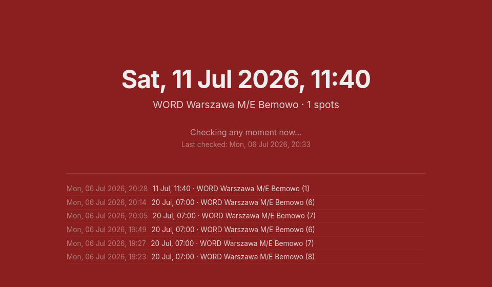

# info-kierowca-notifier

[English](README.md) · [Polski](README.pl.md)

Program sprawdza wolne terminy w [info-kierowca.pl](https://info-kierowca.pl), polskim portalu rezerwacji egzaminów na prawo jazdy. Obserwuje dostępność i informuje o wolnym terminie w panelu oraz na telefonie. Samo sprawdzanie jest wyłącznie do odczytu. Opcjonalnie, gdy masz już opłaconą rezerwację i chcesz ją przyspieszyć, program może otworzyć zalogowaną przeglądarkę i przejść do wyboru daty zmiany terminu. Domyślnie wybór nowej daty oraz każde potwierdzenie wykonujesz samodzielnie — nic nie jest automatycznie rezerwowane. Dwa eksperymentalne, domyślnie wyłączone przełączniki w Ustawienia → Automatyzacja mogą wybrać pasujący termin i wysłać zmianę rezerwacji bez kliknięcia użytkownika. Przed ich włączeniem przeczytaj [Jak to działa](#jak-to-działa) i [docs/ADVANCED.md](docs/ADVANCED.md).

## Szybki start

1. Pobierz wersję dla swojego systemu z [strony wydań](../../releases) — bez instalatora, Pythona ani dodatkowej konfiguracji.
2. Uruchom program. Karta przeglądarki otworzy się automatycznie.
3. Wybierz **Profil Zaufany** (zalecane), wpisz nazwę użytkownika i hasło oraz sparuj Google
   Messages Web zgodnie z instrukcją. Dzięki temu pierwsze logowanie i późniejsze odnawianie sesji
   przebiegają automatycznie. Logowanie kodem QR mObywatel pozostaje ręczną opcją zapasową.
4. Potrzebujesz już zarezerwowanego egzaminu: aplikacja zmienia datę tej rezerwacji, a nie tworzy nowej. Przygotuj datę tej rezerwacji.
5. Potwierdź wykryty numer PKK/kategorię prawa jazdy (lub wypełnij je ręcznie), wybierz ośrodek/ośrodki egzaminacyjne, **wpisz datę rezerwacji do zmiany terminu** i wybierz sposób powiadamiania.

Od tej pory otwarta karta przeglądarki jest Twoim panelem; znajduje się w niej przycisk **Zakończ** do wyłączenia programu.

**Tylko przy pierwszym uruchomieniu:** ponieważ buildy nie są podpisane, Windows/macOS pokaże jednorazowe ostrzeżenie. W Windows wybierz „Więcej informacji” → „Uruchom mimo to”. W macOS kliknij plik prawym przyciskiem i wybierz „Otwórz”.

## Jak to działa

### Uwierzytelnianie

Profil Zaufany jest zalecaną metodą logowania, ponieważ pozwala odnawiać wygasłe sesje bez
oczekiwania na zeskanowanie kodu QR. Logowanie kodem QR mObywatel pozostaje ręczną alternatywą.
Hasło Profilu Zaufanego jest
zapisywane wyłącznie w bezpiecznym magazynie systemu operacyjnego (Menedżer
poświadczeń Windows, Pęk kluczy macOS lub obsługiwana usługa Secret Service w
Linuksie), nigdy w `config.json` ani w źródle strony. Jednorazowo sparuj Google
Messages Web w dedykowanym profilu Chrome aplikacji, aby podczas automatycznego
logowania można było odczytać świeżą wiadomość weryfikacyjną PZePUAP. Gdy
bezpieczny magazyn poświadczeń jest niedostępny, konfiguracja kończy się
bezpiecznym błędem bez zapisu hasła jawnym tekstem.

Sparowanie Google Messages Web jest wymagane do automatycznego logowania przez
Profil Zaufany i odnawiania sesji. Struktura stron rządowych i Google może się
zmienić, dlatego przed włączeniem trybu bezobsługowego obserwuj jedno pełne
logowanie na żywo.

Program sprawdza te same dwa endpointy, których używa strona info-kierowca.pl do wyświetlania terminów. Robi to automatycznie, według zegara, zamiast ręcznego odświeżania strony. Sprawdzanie jest ściśle tylko do odczytu: nie rezerwuje ani nie wykonuje żadnego działania poza sprawdzeniem dostępności.

Jeśli włączysz pomoc przy zmianie terminu (domyślnie włączona, przełącznik `auto_open_browser`), pasujący termin otworzy także zalogowane okno Chrome na ekranie „zmień termin” istniejącej rezerwacji. Domyślnie program zatrzymuje się tam, na pustym wyborze zakresu dat, bez wysyłania danych — nową datę wybierasz i potwierdzasz ręcznie. W Ustawienia → Automatyzacja są dwa kolejne przełączniki, oba domyślnie wyłączone: pierwszy wybiera pasujący termin i przechodzi do podsumowania, drugi — wymagający pierwszego i własnego okna potwierdzenia przed włączeniem — również go potwierdza, faktycznie wysyłając zmianę rezerwacji bez kliknięcia użytkownika. Dokładny opis kliknięć i uzasadnienie znajdują się w [docs/ADVANCED.md](docs/ADVANCED.md). Nigdy nie włączaj drugiej opcji, zanim nie sprawdzisz, że wybór terminu działa niezawodnie.

Sesja info-kierowca.pl nadal wygasa po około godzinie. Po skonfigurowaniu Profilu Zaufanego
aplikacja rozpoczyna jej odnawianie pięć minut przed szacowanym wygaśnięciem: otwiera dedykowany
profil Chrome, podaje bezpiecznie zapisane dane logowania, odczytuje nowy kod weryfikacyjny
PZePUAP ze sparowanej karty Google Messages Web i automatycznie przywraca sesję. Przy wybranym
mObywatelu czeka do faktycznego wygaśnięcia sesji, a następnie otwiera ekran kodu QR i czeka na
jego zeskanowanie. Wymagania, zachowanie awaryjne i rozwiązywanie problemów opisano w sekcji
[automatyczne ponowne logowanie](docs/ADVANCED.md#auto-relogin-on-session-expiry).

Pliki cookie sesji i numer PKK nie trafiają nigdzie poza info-kierowca.pl.

Program korzysta z nieudokumentowanego API, które info-kierowca.pl może w każdej chwili zmienić lub zablokować. Korzystaj na własne ryzyko i zgodnie z regulaminem serwisu.

## Powiadomienia

Podczas konfiguracji otrzymasz prywatny link. Zainstaluj [aplikację ntfy](https://ntfy.sh/app) i zasubskrybuj dokładnie ten link, aby otrzymać powiadomienie push, gdy pojawi się termin w wybranym przedziale.

## Uruchamianie ze źródeł / konfiguracja zaawansowana

Chcesz uruchomić program ze źródeł, używać go w Linuksie z systemd lub poznać szczegóły automatycznego logowania? Zobacz [docs/ADVANCED.md](docs/ADVANCED.md).

## Współpraca

Zgłoszenia i PR-y są mile widziane. To małe narzędzie o jednym celu, dlatego prosimy o skupione zmiany.
Kod uruchomieniowy znajduje się w instalowalnym pakiecie `src/info_kierowca_notifier/`, ręcznie
uruchamiane narzędzia utrzymaniowe w `tools/`, a płaski katalog `tests/` jest wykrywany poleceniem
`uv run python -m unittest discover -s tests -v`.

## Licencja

MIT — zobacz [LICENSE](LICENSE).
